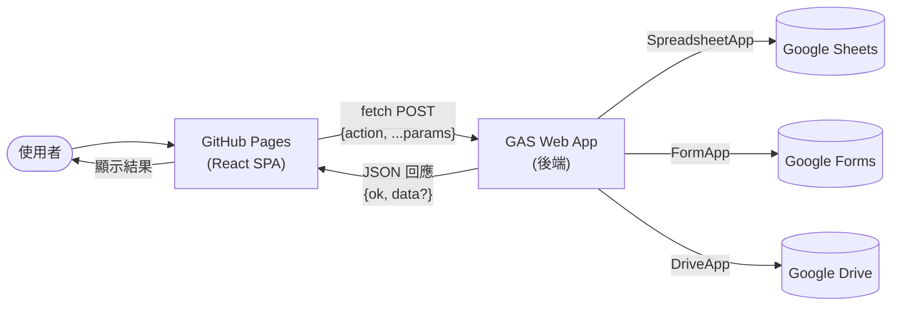
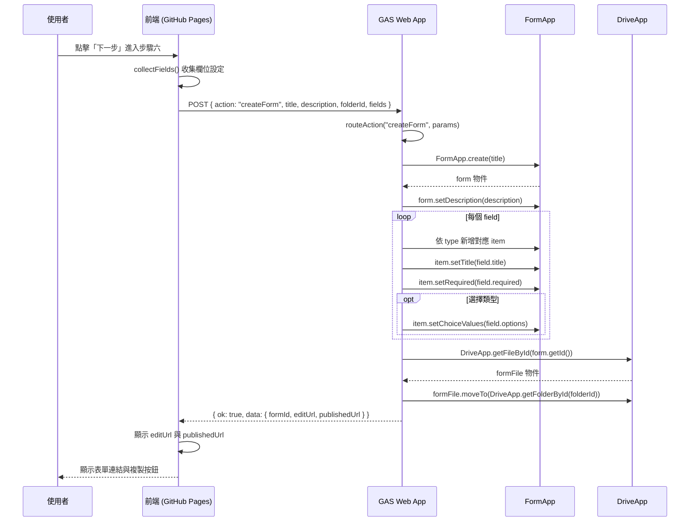
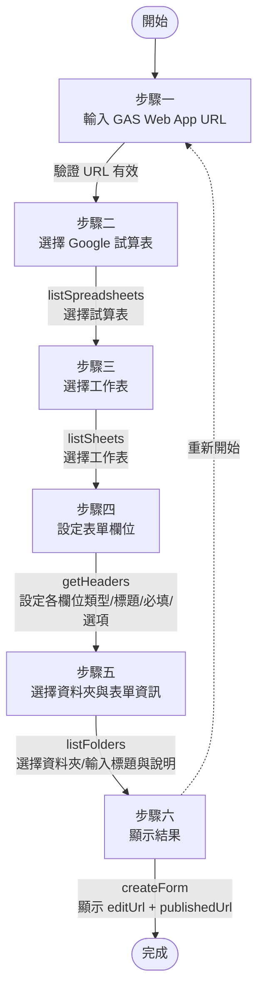

# 架構說明 (Architecture)

## 1. 系統概述

本系統採用「靜態前端 + GAS Web App 後端」的分離架構。前端以 React + Vite 建置為靜態 SPA，部署於 GitHub Pages；後端為 Google Apps Script Web App，負責所有 Google API 操作。兩者透過 HTTP POST 以 JSON 格式通訊。

## 2. 為何前端委託 GAS 處理所有 Google API 呼叫

### 安全性考量

若將 Google API 呼叫直接放在前端，則必須在前端程式碼中嵌入 API 金鑰或 OAuth 憑證。由於前端程式碼會被瀏覽器完整下載，任何使用者都能檢視原始碼並取得憑證，造成嚴重的安全風險。

透過 GAS 後端代理所有 Google API 呼叫，可達成以下安全目標：

1. **前端無敏感資訊**：前端程式碼中不含任何 API 金鑰、OAuth client secret 或憑證。
2. **權限最小化**：GAS 專案僅授予必要的 OAuth 範圍（`spreadsheets`、`forms`、`drive`、`script.external_request`），定義於 `appsscript.json`。
3. **以部署者身份執行**：GAS Web App 設定為 `executeAs: USER_DEPLOYING`，API 操作使用部署者的權限，而非終端使用者的權限。
4. **集中控管**：所有 Google API 呼叫集中於 `Code.gs`，便於審查與權限管理。

### 架構分離的優勢

| 面向 | 前端 (GitHub Pages) | 後端 (GAS) |
|---|---|---|
| 職責 | 使用者介面、輸入驗證、狀態管理 | Google API 操作、業務邏輯、錯誤處理 |
| 技術 | React + Vite (靜態 SPA) | Google Apps Script (V8) |
| 部署 | `git push` → CI 建置 → GitHub Pages | `clasp push` → GAS |
| 更新頻率 | 高（UI 變更） | 低（API 變更） |
| 憑證 | 無 | OAuth 範圍定義於 `appsscript.json` |

## 3. 資料流程

### 3.1 整體架構流程



### 3.2 建立表單流程（時序圖）

以下時序圖展示使用者從精靈步驟五進入步驟六時，系統建立 Google 表單的完整流程：



### 3.3 精靈流程圖

以下流程圖展示使用者從步驟一到步驟六的完整精靈流程：



## 4. 前端架構

前端採用 React + Vite，以元件化的方式組織。主要模組如下：

| 模組 | 檔案 | 職責 |
|---|---|---|
| 常數定義 | `src/constants.js` | `GAS_WEB_APP_URL`（硬編碼後端網址）、`QUESTION_TYPES`（8 種問題類型）、`CHOICE_TYPES`（需選項的類型）、`STEP_LABELS` |
| GAS 通訊 | `src/api.js` | `getGasUrl()`、`callGas(payload)` — 封裝 fetch POST 與錯誤處理；匯出 `listSpreadsheets`、`listSheets`、`getHeaders`、`listFolders`、`createForm` |
| 應用根元件 | `src/App.jsx` | 精靈狀態管理（`useState`）、步驟導覽（`goNext`/`goBack`/`goTo`）、欄位更新、建立表單 payload 組裝 |
| 步驟指示器 | `src/components/StepIndicators.jsx` | 6 步驟進度指示，可點擊已完成步驟返回 |
| 步驟一 | `src/components/StepUrl.jsx` | 顯示後端服務設定資訊（GAS Web App URL 已硬編碼），無需手動輸入 |
| 步驟二 | `src/components/StepSpreadsheets.jsx` | 呼叫 `listSpreadsheets`，下拉選擇試算表 |
| 步驟三 | `src/components/StepSheets.jsx` | 呼叫 `listSheets`，下拉選擇工作表分頁 |
| 步驟四 | `src/components/StepFields.jsx` | 呼叫 `getHeaders`，渲染欄位卡片（類型、標題、必填、選項編輯器） |
| 步驟五 | `src/components/StepFolder.jsx` | 呼叫 `listFolders`，選擇資料夾、輸入表單標題與說明 |
| 步驟六 | `src/components/StepResult.jsx` | 顯示摘要、呼叫 `createForm`、顯示結果連結與複製按鈕 |
| 樣式 | `src/styles.css` | Google 風格主題，CSS 變數、響應式設計、無障礙支援 |

前端狀態由 `App.jsx` 集中管理，透過 props 傳遞至各步驟元件。每個步驟元件內部使用 `useState` 管理局部 UI 狀態（如載入中、錯誤訊息），並以 `useEffect` 在掛載時載入後端資料。

## 5. 後端架構

後端 `Code.gs` 的結構如下：

| 模組 | 職責 |
|---|---|
| `ACTIONS` 常數 | 定義 5 個 action 名稱 |
| `doGet(e)` / `doPost(e)` | HTTP 端點，解析請求並回傳 JSON |
| `routeAction(action, params)` | 依 action 路由至對應處理函式 |
| `handleListSpreadsheets()` | 列出 Drive 中的試算表 |
| `handleListSheets()` | 列出試算表的工作表分頁 |
| `handleGetHeaders()` | 取得工作表第一列標題 |
| `handleListFolders()` | 列出 Drive 根目錄的資料夾 |
| `handleCreateForm()` | 建立 Google 表單並移動至指定資料夾 |

所有處理函式皆以 `try/catch` 包裝，錯誤時回傳 `{ ok: false, error: e.message }`。

## 6. 通訊協定

### 請求格式

前端透過 `fetch()` 發送 POST 請求：

```
POST {GAS Web App URL}
Content-Type: application/json

{
  "action": "actionName",
  ...其他參數
}
```

### 回應格式

所有回應皆為 JSON：

```json
{
  "ok": true,
  "data": { ... }
}
```

或錯誤時：

```json
{
  "ok": false,
  "error": "錯誤訊息（繁體中文）"
}
```

### 錯誤處理策略

| 錯誤類型 | 偵測方式 | 前端處理 |
|---|---|---|
| 網路錯誤 | `fetch` 拋出 `TypeError` | 顯示「無法連線至後端服務，請檢查 GAS Web App URL 是否正確。」 |
| HTTP 錯誤 | `response.ok === false` | 顯示「後端回應 HTTP 狀態碼：{status}」 |
| 業務錯誤 | `result.ok === false` | 顯示 `result.error` 的內容 |
| JSON 解析錯誤 | `doPost` 中的 `JSON.parse` 失敗 | 後端回傳 `{ ok: false, error: "無法解析請求主體 JSON：..." }` |
