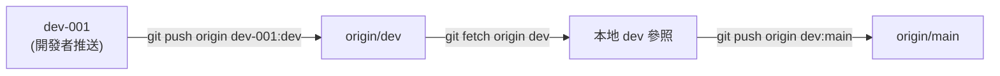

# 設定說明 (Config Settings)

本文件列出本專案所有需要設定的項目，涵蓋前端、後端與 CI/CD 三個層面。每個設定項皆標註其所在檔案或平台位置。

## 1. GAS 後端設定

### 1.1 `appsscript.json`

| 設定項 | 值 | 說明 |
|---|---|---|
| `timeZone` | `Asia/Taipei` | 專案時區。 |
| `runtimeVersion` | `V8` | GAS 執行引擎版本。 |
| `exceptionLogging` | `STACKDRIVER` | 例外記錄方式。 |
| `webapp.access` | `ANYONE_ANONYMOUS` | Web App 允許任何人（含匿名）存取。 |
| `webapp.executeAs` | `USER_DEPLOYING` | 以部署者身份執行，API 操作使用部署者權限。 |

#### OAuth 範圍 (Scopes)

| Scope | 用途 |
|---|---|
| `https://www.googleapis.com/auth/spreadsheets` | 讀取 Google Sheets 試算表與工作表。 |
| `https://www.googleapis.com/auth/forms` | 建立 Google Forms 表單與題目。 |
| `https://www.googleapis.com/auth/drive` | 列出與建立 Google Drive 資料夾。 |
| `https://www.googleapis.com/auth/script.external_request` | 允許 GAS 發出外部 HTTP 請求（保留）。 |

### 1.2 `.clasp.json`（本機 + CI）

```json
{
  "scriptId": "您的 GAS 專案 ID",
  "rootDir": "codebase/gas"
}
```

| 欄位 | 說明 |
|---|---|
| `scriptId` | GAS 專案指令碼 ID，可從 Apps Script 主控台 → 專案設定取得。 |
| `rootDir` | clasp 推送的來源目錄，指向 `codebase/gas/`。 |

### 1.3 `~/.clasprc.json`（本機 + CI）

由 `clasp login` 自動產生，包含 OAuth token 與 client 憑證。CI 環境中透過 GitHub Secret `CLASPRC_JSON` 注入（見 §3.2）。

#### 有瀏覽器的環境

```bash
clasp login
```

#### 無瀏覽器的環境（如遠端 sandbox）

```bash
clasp login --no-localhost
```

clasp 會印出授權 URL，將其在外部瀏覽器開啟並授權。授權後 Google 重導至 `http://localhost:8888/?code=...`，複製瀏覽器網址列的完整 URL 貼回 clasp 提示即可。

> **安全性提示**：此檔案包含 OAuth refresh token，請勿提交至版本控制系統。

## 2. 前端設定

### 2.1 `vite.config.js`

| 設定項 | 值 | 說明 |
|---|---|---|
| `base` | `/google-form-generator/` | Vite 建置的基底路徑，對應 GitHub Pages 子路徑（repo 名稱）。若儲存庫名稱不同，需同步修改。 |
| `plugins` | `[@vitejs/plugin-react]` | React 支援插件。 |

### 2.2 `src/constants.js`

| 常數 | 值 | 說明 |
|---|---|---|
| `STORAGE_KEY` | `gasWebAppUrl` | `localStorage` 鍵名，用於暫存使用者輸入的 GAS Web App URL。 |
| `QUESTION_TYPES` | 8 種類型 | 簡答、段落、單選、核取方塊、下拉式清單、線性刻度、日期、時間。 |
| `CHOICE_TYPES` | 3 種類型 | 單選、核取方塊、下拉式清單（需提供選項）。 |
| `STEP_LABELS` | 6 個標籤 | 精靈各步驟的顯示名稱。 |

### 2.3 `package.json`

| 欄位 | 值 | 說明 |
|---|---|---|
| `name` | `google-form-generator` | 專案名稱。 |
| `version` | `0.3.2` | 目前版本（與 `CHANGELOG.md` 同步）。 |
| `scripts.dev` | `vite` | 本機開發伺服器。 |
| `scripts.build` | `vite build` | 建置正式版本至 `dist/`。 |
| `scripts.preview` | `vite preview` | 本機預覽建置結果。 |
| `scripts.lint` | `eslint` | ESLint 程式碼檢查。 |

## 3. GitHub 儲存庫設定

### 3.1 Actions 權限

| 設定路徑 | 值 | 說明 |
|---|---|---|
| Settings → Actions → General → Workflow permissions | **Read and write permissions** | CI 需要寫入權限才能推進分支（`dev-001 → dev → main`）。 |

### 3.2 GitHub Secrets

| Secret 名稱 | 用途 | 取得方式 |
|---|---|---|
| `GAS_SCRIPT_ID` | GAS 專案指令碼 ID，寫入 CI 中的 `.clasp.json`。 | Apps Script 主控台 → 專案設定 → 指令碼 ID。 |
| `CLASPRC_JSON` | clasp 認證檔 `~/.clasprc.json` 的完整 JSON 內容。 | 本機執行 `clasp login` 後，`cat ~/.clasprc.json` 取得完整內容。 |

> **新增方式**：Settings → Secrets and variables → Actions → New repository secret。

### 3.3 GitHub Pages

| 設定路徑 | 值 | 說明 |
|---|---|---|
| Settings → Pages → Source | **GitHub Actions** | 前端 CI 直接部署 `dist/` 至 Pages。 |

### 3.4 分支保護規則（若啟用）

若 `dev` 或 `main` 分支設有保護規則，需允許 `github-actions[bot]` 推送：

| 設定項 | 值 |
|---|---|
| Allow force pushes | 視情況開啟（CI 使用 fast-forward push） |
| Restrict pushes that create matching branches | 允許 `github-actions[bot]` |

## 4. CI/CD Pipeline 設定

### 4.1 `.github/workflows/gh.yml`（前端）

| 區段 | 設定 | 說明 |
|---|---|---|
| `on.push.branches` | `dev-001` | 推送到 `dev-001` 時觸發。 |
| `on.push.paths` | `codebase/gh/**`, `.github/workflows/gh.yml` | 僅前端或 workflow 變更時觸發。 |
| `permissions` | `contents: write`, `pages: write`, `id-token: write` | CI 需要的權限。 |
| `concurrency` | `gh-deploy` | 確保同一時間僅一個部署流程。 |
| Jobs | `build → promote → deploy` | 建置 → 推進分支 → 部署 Pages。 |

#### 分支推進流程



### 4.2 `.github/workflows/gas.yml`（後端）

| 區段 | 設定 | 說明 |
|---|---|---|
| `on.push.branches` | `dev-001` | 推送到 `dev-001` 時觸發。 |
| `on.push.paths` | `codebase/gas/**`, `.github/workflows/gas.yml` | 僅後端或 workflow 變更時觸發。 |
| `permissions` | `contents: write` | CI 需要的權限（推進分支）。 |
| `concurrency` | `gas-deploy` | 確保同一時間僅一個部署流程。 |
| Jobs | `promote → deploy` | 推進分支 → clasp push。 |

## 5. 設定檔清單總覽

| 檔案 / 設定 | 位置 | 是否納入版本控制 | 說明 |
|---|---|---|---|
| `appsscript.json` | `codebase/gas/` | 是 | GAS 專案設定（範圍、Web App 存取）。 |
| `vite.config.js` | `codebase/gh/` | 是 | Vite 建置設定（base 路徑）。 |
| `constants.js` | `codebase/gh/src/` | 是 | 前端常數（localStorage key、問題類型）。 |
| `package.json` | `codebase/gh/` | 是 | 前端相依套件與腳本。 |
| `eslint.config.js` | `codebase/gh/` | 是 | ESLint flat config。 |
| `.clasp.json` | `codebase/gas/` | 否（本機）/ CI 動態產生 | clasp 專案設定（scriptId、rootDir）。 |
| `~/.clasprc.json` | 使用者家目錄 | 否 | clasp 認證檔（OAuth token）。 |
| `GAS_SCRIPT_ID` | GitHub Secrets | 否 | GAS 指令碼 ID。 |
| `CLASPRC_JSON` | GitHub Secrets | 否 | clasp 認證 JSON。 |
| Actions permissions | GitHub Settings | 否 | CI 工作流程寫入權限。 |
| Pages source | GitHub Settings | 否 | Pages 部署來源。 |
