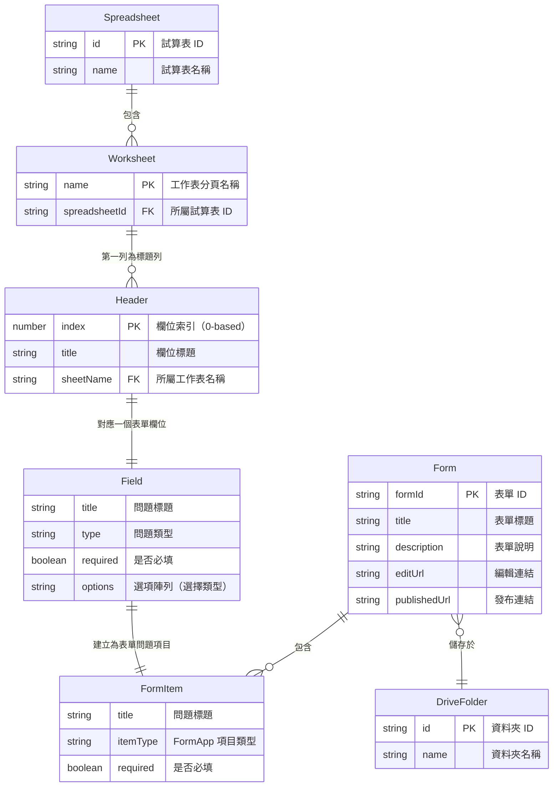

# 實體關係圖 (Entity Relationship Diagram)

本文件以 Mermaid `erDiagram` 描述系統中各資料實體之間的關係。

## 1. 實體關係圖

## 2. 實體說明

### Spreadsheet（試算表）

| 屬性 | 型別 | 說明 |
|---|---|---|
| `id` | string (PK) | Google 試算表檔案 ID，由 `DriveApp.searchFiles` 取得 |
| `name` | string | 試算表檔案名稱 |
| `path` | string | Drive 完整路徑（如 "My Drive/問卷/客戶問卷"） |

- 來源：`listSpreadsheets` action 回傳的 `data` 陣列元素。
- 一個試算表包含多個工作表 (Worksheet)。

### Worksheet（工作表）

| 屬性 | 型別 | 說明 |
|---|---|---|
| `name` | string (PK) | 工作表分頁名稱 |
| `index` | number | 工作表在試算表中的索引（0-based） |
| `spreadsheetId` | string (FK) | 所屬試算表 ID |

- 來源：`listSheets` action 回傳的 `data` 物件陣列（`{ name, index }`）。
- 一個工作表的第一列包含多個欄位標題 (Header)。

### Header（欄位標題）

| 屬性 | 型別 | 說明 |
|---|---|---|
| `index` | number (PK) | 欄位在工作表中的索引（0-based） |
| `title` | string | 第一列該欄位的值（欄位標題） |
| `sheetName` | string (FK) | 所屬工作表名稱 |

- 來源：`getHeaders` action 回傳的 `data` 陣列元素。
- 每個 Header 對應一個表單欄位設定 (Field)。

### Field（表單欄位設定）

| 屬性 | 型別 | 說明 |
|---|---|---|
| `title` | string | 問題標題（使用者可修改） |
| `type` | string | 問題類型（簡答、段落、單選等） |
| `required` | boolean | 是否必填 |
| `options` | string[] | 選項陣列（僅選擇類型） |

- 來源：前端使用者在步驟四的設定，為 `createForm` action 請求中 `fields` 陣列的元素。
- 每個 Field 建立為一個表單問題項目 (FormItem)。

### Form（表單）

| 屬性 | 型別 | 說明 |
|---|---|---|
| `formId` | string (PK) | Google 表單 ID |
| `title` | string | 表單標題 |
| `description` | string | 表單說明 |
| `editUrl` | string | 表單編輯連結 |
| `publishedUrl` | string | 表單發布連結 |

- 來源：`createForm` action 回傳的 `data` 物件。
- 一個表單包含多個問題項目 (FormItem)。
- 一個表單儲存於一個 Drive 資料夾 (DriveFolder)。

### FormItem（表單問題項目）

| 屬性 | 型別 | 說明 |
|---|---|---|
| `title` | string | 問題標題 |
| `itemType` | string | FormApp 項目類型（TextItem、MultipleChoiceItem 等） |
| `required` | boolean | 是否必填 |

- 來源：`handleCreateForm` 中透過 `form.addTextItem()` 等方法建立。
- 每個 FormItem 對應一個 Field 設定。

### DriveFolder（Drive 資料夾）

| 屬性 | 型別 | 說明 |
|---|---|---|
| `id` | string (PK) | Google Drive 資料夾 ID |
| `name` | string | 資料夾名稱 |
| `path` | string | Drive 完整路徑（如 "My Drive/表單封存"） |

- 來源：`listFolders` action 回傳的 `data` 陣列元素。
- 一個 DriveFolder 可儲存多個表單 (Form)。

## 3. 關係說明

| 關係 | 基數 | 說明 |
|---|---|---|
| Spreadsheet → Worksheet | 1 對多 | 一個試算表包含多個工作表分頁 |
| Worksheet → Header | 1 對多 | 一個工作表的第一列包含多個欄位標題 |
| Header → Field | 1 對 1 | 每個欄位標題對應一個表單欄位設定 |
| Field → FormItem | 1 對 1 | 每個欄位設定建立為一個表單問題項目 |
| Form → FormItem | 1 對多 | 一個表單包含多個問題項目 |
| Form → DriveFolder | 多對 1 | 多個表單可儲存於同一個資料夾 |
