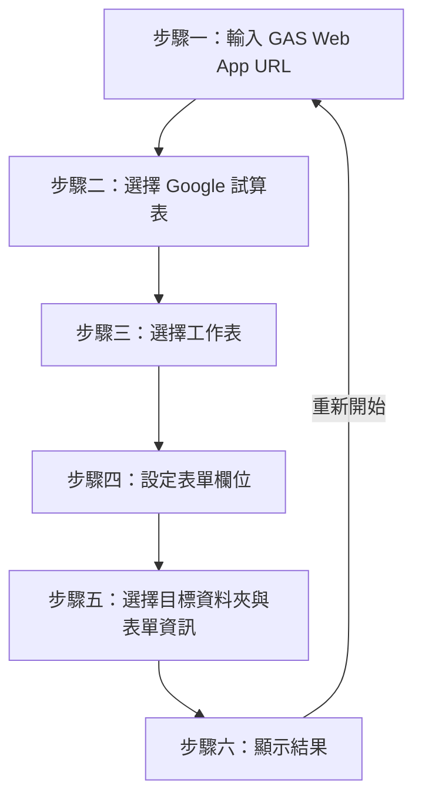

# 產品需求文件 (Product Requirements Document)

## 1. 產品概述

本產品是一個 Google 表單建立精靈，讓使用者透過網頁介面，從 Google 試算表的標題列自動產生 Google 表單。前端部署於 GitHub Pages，後端由 Google Apps Script (GAS) 提供 API，所有 Google API 操作皆在 GAS 端完成。

## 2. 目標使用者

- 需要從現有試算表資料建立問卷或表單的行政人員
- 需要批次建立多個表單問題的問卷設計者
- 不熟悉程式設計但需要自動化表單建立流程的一般使用者

## 3. 精靈流程

精靈共分 6 個步驟，使用者依序完成每一步即可建立 Google 表單：

### 3.1 步驟一：輸入 GAS Web App URL

- **目的**：設定後端 GAS Web App 的部署網址。
- **操作**：使用者輸入 GAS Web App URL，點擊「儲存網址」可將 URL 暫存至瀏覽器 localStorage。
- **驗證**：URL 不可為空，且必須為有效網址格式（通過 `new URL()` 驗證）。
- **GAS Action**：無（此步驟僅設定通訊端點）。

### 3.2 步驟二：選擇 Google 試算表

- **目的**：從使用者的 Google Drive 中列出所有試算表檔案供選擇。
- **操作**：使用者從下拉式選單中選擇一份試算表。
- **GAS Action**：`listSpreadsheets` — 透過 `DriveApp.searchFiles` 搜尋 MIME 類型為 `application/vnd.google-apps.spreadsheet` 的檔案。
- **驗證**：必須選擇一份試算表。

### 3.3 步驟三：選擇工作表

- **目的**：列出所選試算表中的所有工作表分頁名稱。
- **操作**：使用者從下拉式選單中選擇一個工作表分頁。
- **GAS Action**：`listSheets` — 透過 `SpreadsheetApp.openById().getSheets()` 取得所有工作表名稱與索引，回傳 `{ name, index }` 物件陣列。
- **驗證**：必須選擇一個工作表。
- **備註**：系統將讀取所選工作表的第一列作為欄位標題。

### 3.4 步驟四：設定表單欄位

- **目的**：為試算表標題列的每個欄位設定問題類型、問題標題、是否必填及選項內容。
- **操作**：
  - 系統自動讀取工作表第一列的所有欄位標題。
  - 每個欄位顯示為一張設定卡片，包含：
    - 問題類型下拉式選單（8 種類型）。
    - 問題標題輸入框（預設填入試算表欄位標題）。
    - 必填核取方塊。
    - 選項編輯器（僅選擇類型顯示，每行一個選項）。
- **GAS Action**：`getHeaders` — 透過 `sheet.getRange(1, 1, 1, maxColumns).getValues()[0]` 取得第一列標題。
- **驗證**：所有欄位的問題標題不可為空。

### 3.5 步驟五：選擇目標資料夾與表單資訊

- **目的**：選擇表單儲存的目標資料夾，並輸入表單標題與說明。
- **操作**：
  - 從下拉式選單選擇 Google Drive 根目錄下的資料夾。
  - 輸入表單標題（預設填入試算表名稱）。
  - 輸入表單說明（選填）。
- **GAS Action**：`listFolders` — 透過 `DriveApp.getFolders()` 列出根目錄下所有資料夾。
- **驗證**：必須選擇資料夾並輸入表單標題。

### 3.6 步驟六：顯示結果

- **目的**：建立 Google 表單並顯示表單連結。
- **操作**：
  - 系統自動呼叫 `createForm` 建立表單。
  - 顯示編輯連結 (Edit URL) 與發布連結 (Published URL)。
  - 提供複製按鈕。
  - 點擊「重新開始」可重置所有狀態回到步驟一。
- **GAS Action**：`createForm` — 透過 `FormApp.create()` 建立表單，新增各欄位對應的問題項目，再透過 `DriveApp.getFileById().moveTo()` 移動至指定資料夾。

## 4. 表單類型

本產品支援以下 8 種問題類型：

| 中文標籤 | type 字串 | FormApp 項目類型 | 需要選項 |
|---|---|---|---|
| 簡答 | `簡答` / `short` | `TextItem` | 否 |
| 段落 | `段落` / `paragraph` | `ParagraphTextItem` | 否 |
| 單選 | `單選` / `multiple_choice` | `MultipleChoiceItem` | 是 |
| 核取方塊 | `核取方塊` / `checkboxes` | `CheckboxItem` | 是 |
| 下拉式清單 | `下拉式清單` / `list` | `ListItem` | 是 |
| 線性刻度 | `線性刻度` / `linear_scale` | `ScaleItem` | 否 |
| 日期 | `日期` / `date` | `DateItem` | 否 |
| 時間 | `時間` / `time` | `TimeItem` | 否 |

## 5. 資料夾選擇

- 使用者可從 Google Drive 根目錄下的資料夾中選擇目標儲存位置。
- 表單建立後會自動從預設位置（Drive 根目錄）移動至使用者選擇的資料夾。
- 若根目錄下無任何資料夾，系統會顯示錯誤訊息提示使用者先建立資料夾。

## 6. 表單建立

- 表單標題由使用者輸入，預設值為所選試算表的名稱。
- 表單說明為選填欄位。
- 每個欄位依其設定的問題類型建立對應的 FormApp 項目：
  - 設定問題標題 (`item.setTitle()`)。
  - 設定是否必填 (`item.setRequired()`)。
  - 選擇類型需設定選項 (`item.setChoiceValues()`)。
- 表單建立成功後回傳 `formId`、`editUrl` 與 `publishedUrl`。
- 表單會透過 `DriveApp.getFileById(form.getId()).moveTo(DriveApp.getFolderById(folderId))` 移動至指定資料夾。

## 7. 非功能性需求

| 項目 | 需求 |
|---|---|
| 語言 | 介面與文件皆使用繁體中文 |
| 前端技術 | 純 Vanilla JS，不使用任何框架或 CDN |
| 回應式設計 | 支援手機與桌面瀏覽器 |
| 無障礙 | 支援鍵盤導覽與 `prefers-reduced-motion` |
| 錯誤處理 | 所有錯誤皆以繁體中文顯示，區分網路錯誤與業務錯誤 |
| 資料暫存 | GAS URL 暫存於 localStorage，鍵名為 `gasWebAppUrl` |
